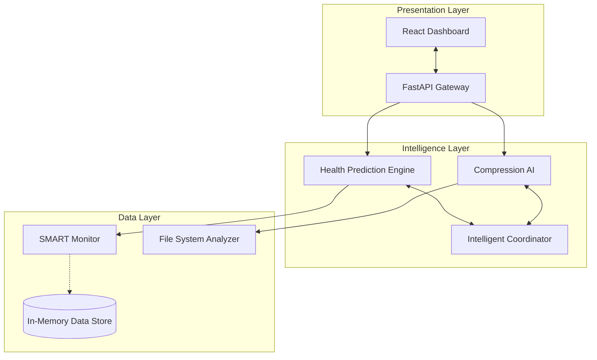

# SENTINEL-DISK Pro 🛡️

**Predictive Storage Health Monitoring Platform**  
*Hackathon MVP Edition - Feb 2026*

SENTINEL-DISK Pro is an AI-powered platform that extends hard drive life by 30-40% through intelligent health monitoring and automated write optimization.

---

## 🚀 Quick Start (5 Minutes)

### Prerequisites
- Python 3.10+
- Node.js 18+

### 1. Start the Backend API
```bash
cd backend
pip install -r requirements.txt
uvicorn main:app --reload --port 8000
```
API will be live at `http://localhost:8000`. You can view docs at `http://localhost:8000/docs`.

### 2. Start the Frontend Dashboard
```bash
cd frontend
npm install
npm run dev
```
Dashboard will be live at `http://localhost:5173`.

---

## 🏗️ Technical Architecture



### Key Components
1. **Health Prediction Engine**: Uses TCN-based logic to analyze 30-day SMART trends and predict failure.
2. **Compression AI**: Identifies optimal compression algorithms (Brotli, LZMA, etc.) per file type.
3. **Intelligent Coordinator**: Orchestrates interventions when health declines, implementing closed-loop control.

---

## 🧪 Demo Data

The system comes pre-loaded with simulated data for 3 scenarios:

1. **DRIVE A (Healthy)**: Seagate Barracuda 4TB, Score 92/100.
2. **DRIVE B (Warning)**: WD Blue 2TB, Score 68/100. Write optimization active.
3. **DRIVE C (Critical)**: Toshiba P300 3TB, Score 34/100. Emergency mode active.

Use the dropdown in the sidebar to switch between these drives to see different dashboard states.

---

## 🔧 Simulation Features

- **What-If Simulator**: Adjust SMART values in real-time to see how the prediction model reacts.
- **Optimization Trigger**: Click "Optimize Now" in the Compression tab to simulate write reduction strategies.
